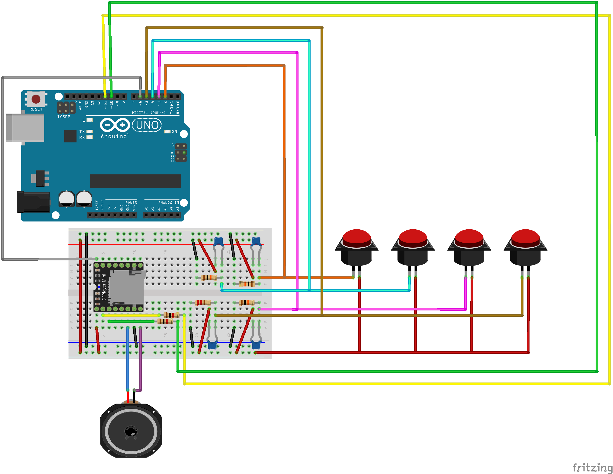

# CaprerAVR

**CaprerAVR** is a crazy project for office survival, when you are in difficult, push the buzz button and **CaprerAVR** helps you!!

## Info

**CaprerAVR** is made using a **DFR0299** module drived by **Arduino** using the **[DFPlayer-Mini-mp3 library](https://github.com/DFRobot/DFPlayer-Mini-mp3/)** (if some functions are missing, try using [my version](https://github.com/ciotto/DFPlayer-Mini-mp3/))

## What you need

 - *1 x* [DFR0299](http://it.aliexpress.com/item/1PCS-Mini-MP3-Player-Module-with-Simplified-Output-Speaker-for-Arduino-UNO/32271693515.html)
 - *4 x* [Buzz Button](http://it.aliexpress.com/item/1PC-LED-Light-60MM-Big-Round-Arcade-Video-Game-Player-Push-Button-Switch-Red-Plunger-Size/32645265359.html)
 - *1 x* microSD card
 - *2 x* 1k resistors
 - *4 x* 10k resistor
 - *4 x* ~100nF capacitator
 - *1 x* speaker
 - *some* mp3 samples
 
## Links

 - [DFR0299 datasheet 1](http://www.picaxe.com/docs/spe033.pdf)
 - [DFR0299 datasheet 2](http://www.trainelectronics.com/Arduino/MP3Sound/TalkingTemperature/FN-M16P%20Embedded%20MP3%20Audio%20Module%20Datasheet.pdf)
 - [DFR0299 doc](http://www.dfrobot.com/wiki/index.php/DFPlayer_Mini_SKU:DFR0299)
 - [DFPlayer-Mini-mp3 library](https://github.com/DFRobot/DFPlayer-Mini-mp3/archive/master.zip)
 - [DFPlayer-Mini-mp3 library (my version)](https://github.com/ciotto/DFPlayer-Mini-mp3/archive/master.zip)
