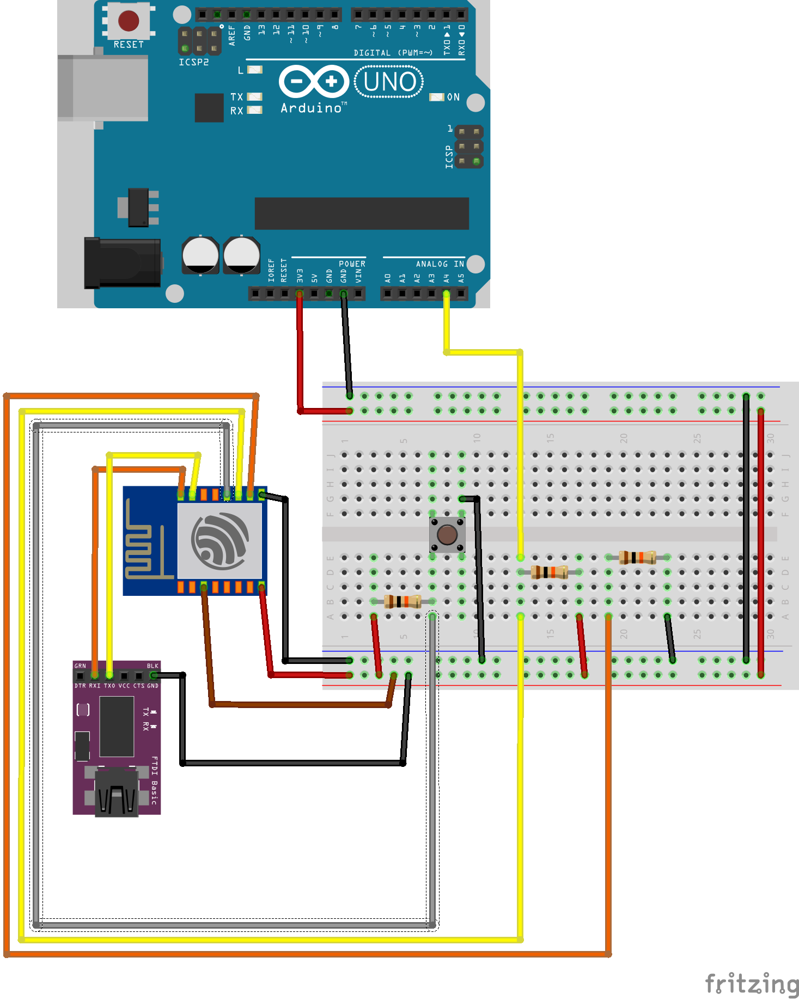

# CaprerAVR


**CaprerAVR** is a crazy project for office survival, when you are in difficult, push the buzz button and **CaprerAVR** helps you!!


### Breadboar Schematic


### Info

**CaprerAVR** is made using a **DFR0299** module drived by **Arduino** using the **[DFPlayer-Mini-mp3 library](https://github.com/DFRobot/DFPlayer-Mini-mp3/)** (if some functions are missing, try using [my version](https://github.com/ciotto/DFPlayer-Mini-mp3/))


### What you need

 - *1 x* [Arduino or compatible](http://www.aliexpress.com/item/UNO-R3-CH340G-ATmega328P-compatible-for-Arduino-UNO-R3/32523366108.html?spm=2114.01010208.3.132.ps5asV&ws_ab_test=searchweb201556_8,searchweb201602_5_10037_10017_405_507_10032,searchweb201603_11&btsid=4d84a66e-7b4c-4053-977e-ca0880699bd8)
 - *1 x* [DFR0299](http://it.aliexpress.com/item/1PCS-Mini-MP3-Player-Module-with-Simplified-Output-Speaker-for-Arduino-UNO/32271693515.html)
 - *4 x* [Buzz Button](http://it.aliexpress.com/item/1PC-LED-Light-60MM-Big-Round-Arcade-Video-Game-Player-Push-Button-Switch-Red-Plunger-Size/32645265359.html)
 - *1 x* microSD card
 - *2 x* 1k resistors
 - *4 x* 10k resistor
 - *4 x* ~100nF capacitator
 - *1 x* speaker
 - *some* mp3 samples

## ESP8266

It's possible to add networking capabilities to this awesome device thank to the ``ESP8266`` module.

There are many versions of the ESP8266 and I tested with the [ESP-12e](https://it.aliexpress.com/wholesale?catId=0&initiative_id=SB_20161009205149&SearchText=esp-12e).


Be careful, ESP8266 use a lot of current and work at **3.3V**, so if you have problem during scketch upload problably you don't have enought current (from specific *170mA*). Evaluate to use an external power source.


Follow instruction from this [repository](https://github.com/esp8266/Arduino) to enable the board on the Arduino IDE.



In order to flash the firmware you need to set in programming mode the module: connect the pins ``GPIO0`` and ``GPIO15`` to **GND** and ``GPIO2 `` to **V<sub>CC</sub>**; after setup re-power. For normal operation instead connect ``GPIO0`` to **V<sub>CC</sub>**.

 Mode | GPIO0 | GPIO2 | GPIO15 
------|--------|--------|---------
 UART Download Mode (Programming) | 0 | 1 | 0 
 Flash Startup (Normal) | 1 | 1 | 0 
 SD-Card Boot | 0 | 0 | 1 

For some version of ``ESP8266`` (ex. ``ESP-01``) only ``GPIO0`` pin to **GND** is required.

At the [arduino/WifiWebServer/](arduino/WifiWebServer/) path you can find a simple web service that send commands on the ``GPIO 2`` serial.

From the serial console you can observe this output:

```
Connecting......

Connected to your-ssid
URL: http://192.168.1.11/
MDNS responder started
HTTP server started
```

### Compiling .html files

I made a simple *Python* tool that convert all **.html** pages in the [arduino/WifiWebServer/html/](arduino/WifiWebServer/html/) folder in **C headers** files with same naming.

###### Ex.

 HTML file | Header file | Header variable
------|--------|--------|---------
 html/index.html | index.h | INDEX 
 
###### Use

In order to use it, you can simple do this command:

```
	$ pip install -r requirements.txt
	$ python html_to_header.py
	Create arduino/WifiWebServer/index.h 
```

### What you need

 - *1 x* [ESP8266](https://it.aliexpress.com/item/2015-New-version-1PCS-ESP-12F-ESP-12E-upgrade-ESP8266-remote-serial-Port-WIFI-wireless-module/32510124042.html)
 - *1 x* [Push button](https://it.aliexpress.com/item/Promotion-Amico-100-Pcs-6x6x4-5mm-Panel-PCB-Momentary-Tactile-Tact-Push-Button-Switch-4-Pin/32563399489.html)
 - *4 x* 10k resistor
 - *1 x* [Serial adapter](https://it.aliexpress.com/item/3-3V-5V-FTDI-Basic-Program-Downloader-USB-to-TTL-FT232RL-For-Arduino/32409683938.html?spm=2114.13010608.0.0.WA7239)
 
## Links
 - [DFR0299 datasheet 1](http://www.picaxe.com/docs/spe033.pdf)
 - [DFR0299 datasheet 2](http://www.trainelectronics.com/Arduino/MP3Sound/TalkingTemperature/FN-M16P%20Embedded%20MP3%20Audio%20Module%20Datasheet.pdf)
 - [DFR0299 doc](http://www.dfrobot.com/wiki/index.php/DFPlayer_Mini_SKU:DFR0299)
 - [ESP-12e datasheet](https://mintbox.in/media/esp-12e.pdf)
 - [ESP8266 Bootloader Modes](https://zoetrope.io/tech-blog/esp8266-bootloader-modes-and-gpio-state-startup)
 - [DFRobotDFPlayerMini library](https://github.com/DFRobot/DFRobotDFPlayerMini/archive/1.0.1.zip)
